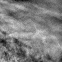
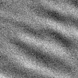
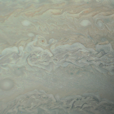

planet-patch-classifier
=======================

**planet-patch-classifier** will be a Python tool for generating
and classifying [planet patches](#planet-patches) from
[satellite imagery](#satellite-datasets) via unsupervised machine learning.

Planet Patches
--------------
Planet patches are square images of a planet from different viewing angles in nadir
geometry (i.e. face-on view of the surface). They are obtained from the raw satellite
imagery via geometrical projections and interpolation.

### Examples
| Akatsuki Patch Example                                    | Venus Express Patch Example                               | Juno Patch Example                                         |
| --------------------------------------------------------- | --------------------------------------------------------- | ---------------------------------------------------------- |
|  |  |  |
| Scale: 3,000 km                                           | Scale: 25 km                                              | Scale: 25,000 km                                           |
| Resolution: 128 px                                        | Resolution: 128 px                                        | Resolution: 224 px                                         |
| Original file: <br /> *uvi_20180502_100446_365_v10.fit*   | Original file: <br /> *V1559_0044_UV2.IMG*                | Original file: <br /> *JNCR_2017244_08C00121_V01.IMG*      |

Satellite Datasets
-------------------
The following satellite image datasets will be supported by default:
1. [Akatsuki / Venus Climate Orbiter (*VCO*)](https://darts.isas.jaxa.jp/planet/project/akatsuki/)
2. [Venus Express (*VEX*)](https://www.cosmos.esa.int/web/psa/venus-express)
3. [Juno](https://pds-imaging.jpl.nasa.gov/portal/juno_mission.html)

Click [here](docs/satellite-datasets.md) for an explanation of the different dataset
structures.

Installation
------------
1. Download and install **git** on your system: https://git-scm.com/downloads.
2. Download and install the latest version of **Python**: https://www.python.org/downloads/.
3. Clone this repository with:
    ```sh
    git clone https://github.com/jmittendo/planet-patch-classifier
    ```
4. Create a [virtual environment](https://docs.python.org/3/library/venv.html):
    ```sh
    python -m venv .venv
    ```
5. Activate the environment:
    * Windows:
        ```sh
        .venv\Scripts\activate
        ```
    * Linux:
        ```sh
        source .venv/bin/activate
        ```
6. Upgrade **pip** inside the environment:
    ```sh
    python -m pip install -U pip
    ```
7. Install the required packages inside the environment:
    ```sh
    pip install -r requirements.txt
    ```
Usage
-----
Here's how to use the tool...

Creating Your Own Datasets
---------------------------
If you want to create your own dataset, here's how to do it...
