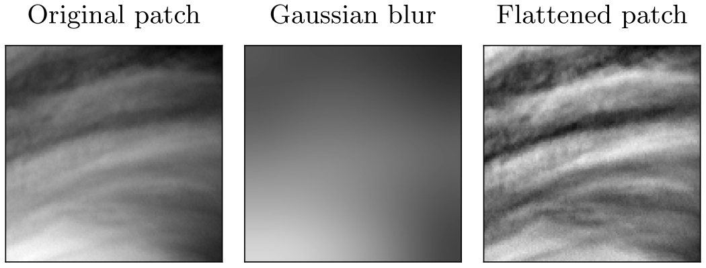

planet-patch-classifier
=======================

**planet-patch-classifier** is a Python tool for generating and classifying
[planet patches](#planet-patches) from [satellite imagery](#satellite-datasets) via
unsupervised machine learning.

Planet Patches
--------------
Planet patches are square images of a planet from different viewing angles in nadir
observation (i.e. face-on view of the surface). They are obtained from the raw satellite
imagery via geometrical projections and interpolation.

### Examples
| Akatsuki Patch Example                                    | Venus Express Patch Example                               | Juno Patch Example                                         |
| --------------------------------------------------------- | --------------------------------------------------------- | ---------------------------------------------------------- |
|  |  |  |
| Scale: 3,000 km                                           | Scale: 25 km                                              | Scale: 25,000 km                                           |
| Resolution: 128 px                                        | Resolution: 128 px                                        | Resolution: 224 px                                         |
| Original file: <br /> *uvi_20180502_100446_365_v10.fit*   | Original file: <br /> *V1559_0044_UV2.IMG*                | Original file: <br /> *JNCR_2017244_08C00121_V01.IMG*      |

Satellite Datasets
-------------------
The following satellite image datasets are supported:
1. [Akatsuki / Venus Climate Orbiter (*VCO*)](https://darts.isas.jaxa.jp/missions/akatsuki/index_en.html)
(Size: ~700 GB)
2. [Venus Express (*VEX*) / Venus Monitoring Camera (*VMC*)](https://www.cosmos.esa.int/web/psa/venus-express)
(Size: ~2 TB)
3. [Juno (*JNO*) / JunoCam (*JNC*)](https://pds-imaging.jpl.nasa.gov/portal/juno_mission.html)
(Size: ~500 GB)

Please look at [this file](docs/datasets.md) for more information.

Installation
------------
1. Download and install **git** on your system: https://git-scm.com/downloads.
2. Download and install **Python 3.11**: https://www.python.org/downloads/.
3. Clone this repository with:
    ```sh
    git clone https://github.com/jmittendo/planet-patch-classifier
    ```
4. Create a [virtual environment](https://docs.python.org/3/library/venv.html):
    ```sh
    python -m venv .venv
    ```
5. Activate the environment:
    * Windows:
        ```sh
        .venv\Scripts\activate
        ```
    * Linux:
        ```sh
        source .venv/bin/activate
        ```
6. Upgrade **pip** inside the environment:
    ```sh
    python -m pip install -U pip
    ```
7. Install the required packages inside the environment:
    ```sh
    pip install -r requirements.txt
    ```
Setup
-----
1. Once downloaded and installed, create a copy of the `config.py` file in
`user/resources/` and place it directly in the `user/` directory.
2. Open the file and set the `DATA_DIR_PATH` variable to any directory on a drive with
considerable disk space (note that the path needs to be enclosed in a `Path` object).
This directory will hold all satellite imagery data (see their sizes
[above](#satellite-datasets)), patch images, model checkpoints, plots etc.
3. Download the  desired [satellite image datasets](#satellite-datasets). Their files
and subdirectories must be formatted and structured exactly as explained in
[this file](docs/datasets.md).
4. (Optional) Check whether you have successfully formatted and structured the
dataset(s) with[*](#running-scripts):
    ```sh
    python scripts/validate_satellite_dataset.py [name]
    ```
    - `[name]`: (Optional) Name of the satellite dataset (i.e. name of the directory).

    This script's output will help you find any formatting errors.

Usage
-----
### Generating Patches
Once you have ensured that your satellite datasets have a valid structure, you can
start generating patches with[*](#running-scripts):
```sh
python scripts/generate_patches.py [-g / --globalnorm] [name] [scale] [resolution]
```
- `[-g / --globalnorm]`: Flag to enable additional output of patch images
with global normalization (i.e. normalized to the full range of values in a
particular satellite image).
- `[name]`: Name of the satellite dataset (i.e. name of the directory).
- `[scale]`: Scale of the patches in km.
- `[resolution]`: Pixel resolution of the patches.

This script will produce a patch dataset located at
`<DATA_DIR_PATH>/data/patch-datasets/<satellite dataset name>/<satellite dataset name>_s<scale>_r<resolution>/`
that contains a `versions` directory (see [here](#generating-patch-dataset-versions)),
an `info.json` file with some metadata, and a `table.pkl` file:

When running this command for a particular satellite dataset for the first time,
a table containing the paths of all satellite dataset files and corresponding
metadata information (e.g. the maximum spatial resolution) will be generated to
speed up the patch generation process in the future. This may take a while. To
(re)generate this table (e.g. after adding new dataset files), you can either delete
the `table.pkl` file in the dataset directory or run the following
script[*](#running-scripts):
```sh
python scripts/generate_satellite_dataset_table.py [name]
```
- `[name]`: (Optional) Name of the satellite dataset (i.e. name of the directory).

The patch generation process can be customized further by adjusting the parameters in
the `PATCHES` section of `user/config.py`. Read the [paper](https://doi.org/10.1016/j.ascom.2024.100884) for a detailed
explanation of their meanings.

### Generating Patch Dataset Versions
Once a patch dataset has been generated, other versions of it can be created. These
versions are stored in a directory `<patch dataset directory>/versions/`. If you
generated a patch dataset with the global normalization flag
[above](#generating-patches), then both a `norm-local` and `norm-global` version of the
dataset should already be available in this directory. Using the following
scripts[*](#running-scripts), you can also generate a *flattened* version (read the
[paper](https://doi.org/10.1016/j.ascom.2024.100884) for a detailed explanation) and a grayscale version of any patch dataset:

-   ```sh
    python scripts/generate_flat_patches.py [name] [sigma] [contrast]
    ```
    - `[name]`: Name of the patch dataset (i.e. name of the directory).
    - `[sigma]`: Sigma value (i.e. standard deviation) for the Gaussian blur.
    - `[contrast]`: Contrast multiplier for the standardization step.

    This script will always use the `norm-local` version to generate the flat patches.
    The following image shows an example of the *flattening* process applied to an
    *Akatsuki* image with `sigma = 16` and `contrast = 0.33`:

    

-   ```sh
    python scripts/generate_grayscale_patches.py [name] [version]
    ```
    - `[name]`: Name of the patch dataset (i.e. name of the directory).
    - `[version]`: Name of the patch dataset version to use.

### Training Models
To classify patches with an *Autoencoder* or
[*SimCLR*](https://arxiv.org/abs/2002.05709), you first need to train such a model on
the respective patch dataset. This can be done with the following
script[*](#running-scripts):
```sh
python scripts/train_model.py [-d / --device DEVICE] [model] [base_model] [dataset] [version]
```
- `[-d / --device DEVICE]`: (Optional) Device to train the model on (e.g. `cpu`,
`cuda:0` etc.).
- `[model]`: Type of model to train (`autoencoder` or `simclr`).
- `[base_model]`: Type of the base model (`resnet18`, `resnet34`, `resnet50`,
`resnet101`, or `resnet152`) for a `simclr` model (`autoencoder` can only use
`resnet18`).
- `[dataset]`: Name of the patch dataset to train the model on (i.e. name of the
directory).
- `[version]`: Name of the patch dataset version to use.

This script will produce model checkpoints at
`<DATA_DIR_PATH>/checkpoints/<model type>/`, corresponding `.json` files that hold
metadata, and `.pkl` table files that contain the training and test losses. It will also
produce a plot of the losses at `<DATA_DIR_PATH>/plots/train-losses/`.

A selection of model checkpoints trained on various patch datasets (used for generating the results of the [paper](https://doi.org/10.1016/j.ascom.2024.100884)) is also available at: https://huggingface.co/jmittendo/cloud-patch-encoders.

### Classifying Patches
Finally, a patch dataset (version) can be classified by calling[*](#running-scripts):
```sh
python scripts/classify_patches.py [-c / --classes CLASSES] [-p / --pca_dims PCA_DIMS] [-m / --hdbscan_min_cluster_size HDBSCAN_MIN_CLUSTER_SIZE] [-d / --device DEVICE] [name] [version] [reduction_method] [clustering_method] [encoder] [base_model]
```
- `[-c / --classes CLASSES]`: (Optional) Number of classes / clusters to produce
(ignored for clustering with HDBSCAN, see `-m` instead; ignored for datasets with
labels)
- `[-p / --pca_dims PCA_DIMS]`: (Optional) Number of dimensions for dimensionality
reduction with PCA (ignored otherwise)
- `[-m / --hdbscan_min_cluster_size HDBSCAN_MIN_CLUSTER_SIZE]`: (Optional) Minimum
number of samples in an HDBSCAN cluster (ignored for other clustering methods)
- `[-d / --device DEVICE]`: (Optional) Device to use for the encoder model (e.g. `cpu`,
`cuda:0` etc.).
- `[name]`: Name of the patch dataset to classify (i.e. name of the directory).
- `[version]`: Name of the patch dataset version to use.
- `[reduction_method]`: Additional dimensionality reduction method to use after encoding
(`tsne`, `pca`, or `none`).
- `[clustering_method]`: Clustering method to use (`kmeans`, `hac`, or `hdbscan`).
- `[encoder]`: Type of encoder model to use (`simple`, `autoencoder`, or `simclr`). For
any encoders other than `simple`, you first need to
[train the corresponding model](#training-models).
- `[base_model]`: Type of base model to use for the encoder
(`resnet18`, `resnet34`, `resnet50`, `resnet101`, or `resnet152`). Unless you're using
the `simple` encoder model, this needs to match a model you trained.

This script will produce three plots located at
`<DATA_DIR_PATH>/plots/classification/<dataset name>/<dataset version>/` that show the
geographical scatter (latitude vs. longitude / local time) of the classes, a 2D
[*t-SNE*](https://scikit-learn.org/stable/modules/generated/sklearn.manifold.TSNE.html)
scatter of encoded data points and the classes, and 8 random examples for each class,
respectively. If the dataset has labels, the t-SNE plot will also include a version
with the original labels and the console will output the class accuracies + total
accuracy, the confusion matrix, and the
[*adjusted rand score*](https://scikit-learn.org/stable/modules/generated/sklearn.metrics.adjusted_rand_score.html).

### Other Scripts
-   ```sh
    python scripts/count_satellite_dataset_files.py [name]
    ```
    - `[name]`: Name of the satellite dataset (i.e. name of the directory).

    Outputs the number of files (image/geometry file pairs) in a satellite dataset.

-   ```sh
    python scripts/plot_patch_dataset.py [-n / --number NUMBER] [name] [version] [encoder] [base_model]
    ```
    - `[-n / --number NUMBER]`: (Optional) Limits the number of images to plot.
    - `[name]`: Name of the patch dataset to plot (i.e. name of the directory).
    - `[version]`: Name of the patch dataset version to use.
    - `[encoder]`: Type of encoder model to use (`simple`, `autoencoder`, or `simclr`). For
    any encoders other than `simple`, you first need to
    [train the corresponding model](#training-models).
    - `[base_model]`: Type of base model to use for the encoder
    (`resnet18`, `resnet34`, `resnet50`, `resnet101`, or `resnet152`). Unless you're using
    the `simple` encoder model, this needs to match a model you trained.

    Creates a geographical and encoded t-SNE scatter plot
    (similar to [above](#classifying-patches)) of the actual patch images located at
    `<DATA_DIR_PATH>/plots/patch-datasets/<dataset name>/<dataset version>/`.

-   ```sh
    python scripts/print_patch_dataset_stats.py [name] [version]
    ```
    - `[name]`: Name of the patch dataset (i.e. name of the directory).
    - `[version]`: Name of the patch dataset version to use.

    Outputs the number of patches and the mean + standard deviation of each image
    channel over the entire dataset.

-   ```sh
    python scripts/run_benchmarks.py
    ```

    Attempts to run the benchmarks from the [paper](https://doi.org/10.1016/j.ascom.2024.100884) on the
    [*Cloud-ImVN 1.0* dataset](docs/datasets.md#cloud-imvn-10-patch-dataset). The
    benchmark can be customized with the parameters under the *BENCHMARK* section in
    `user/config.py`. The benchmark table will be located at
    `<DATA_DIR_PATH>/benchmark-results/`. Make sure you have downloaded and formatted
    the dataset (see [here](docs/datasets.md#cloud-imvn-10-patch-dataset)) and trained
    the required models.

Running Scripts
---------------
Almost all scripts can be run without arguments (except for optional flags) for lists
of available argument values (e.g. available datasets, versions etc.) and manual inputs
during runtime. Don't forget to activate the virtual environment before running a
script!
